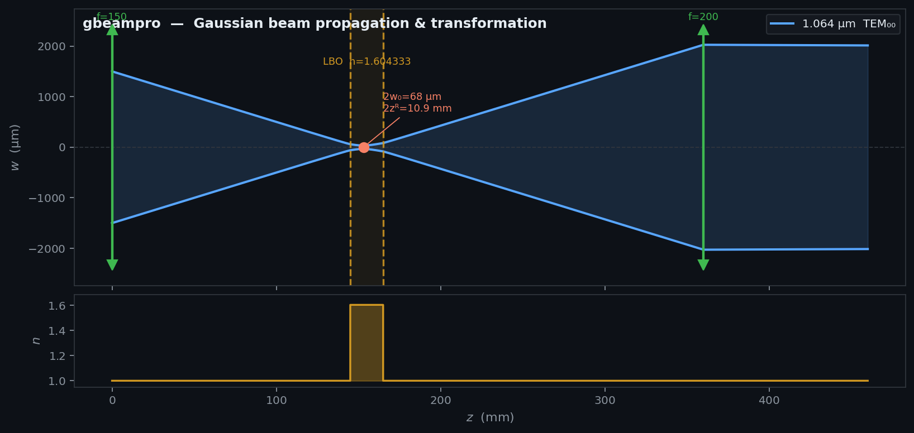

# gbeampro

*gbeampro* is a Python package for Gaussian (TEM₀₀) laser beam propagation and optimization using the ABCD matrix method (q-parameter formalism). It supports beam tracing through arbitrary optical systems and Zemax-inspired merit-function optimization for astigmatic beam shaping.



## Installation

```bash
pip install gbeampro           # core
pip install gbeampro[optimize] # + scipy for optimization
```

## Quick Start

```python
from gbeampro import GaussBeam, Propagation, ThinLens, Interface, OpticalSystem

# Define a beam at its waist: 1064 nm, w₀=1 mm
beam = GaussBeam.from_waist(wl_um=1.064, w0_mm=1.0)

# Build an optical system
sys = (OpticalSystem()
       .add(Propagation(100))
       .add(ThinLens(f_mm=50))
       .add(Interface(n1=1.0, n2=1.5))
       .add(Propagation(30)))

# Print system layout and beam state at each element
print(sys)
print(sys.summary(beam))

# Trace the full caustic
traj = sys.trace(beam, dz=0.5)
```

## API Reference

### `GaussBeam`

Immutable Gaussian beam value object (`frozen dataclass`).

| Parameter | Description | Unit |
|-----------|-------------|------|
| `wl_um` | Wavelength | µm |
| `n` | Refractive index | — |
| `z_mm` | z-coordinate of wavefront | mm |
| `R_mm` | Wavefront curvature radius (`inf` at waist) | mm |
| `w_mm` | Beam radius (1/e² intensity half-width) | mm |

Key properties: `.q` (complex q-parameter), `.theta` (divergence half-angle in rad).

**Constructors**

```python
GaussBeam.from_waist(wl_um, w0_mm, z_mm=0.0, n=1.0)  # from beam waist
GaussBeam.from_q(wl_um, n, q, z_mm=0.0)               # from complex q-parameter
```

### Optical Elements

Each element implements `apply(beam) -> GaussBeam` based on its ABCD matrix.

| Class | Parameters | Description |
|-------|-----------|-------------|
| `Propagation(d_mm)` | `d` — distance (mm) | Free-space propagation |
| `ThinLens(f_mm)` | `f` — focal length (mm) | Thin lens |
| `Interface(n1, n2)` | `n1`, `n2` — refractive indices | Flat dielectric interface |
| `InterfaceCurved(n1, n2, r_mm)` | `r > 0` convex, `r < 0` concave (mm) | Curved dielectric interface |
| `CurvedMirrorTan(r_mm, theta_deg)` | `r` — radius (mm), `θ` — angle of incidence (deg) | Curved mirror, tangential |
| `CurvedMirrorSag(r_mm, theta_deg)` | `r` — radius (mm), `θ` — angle of incidence (deg) | Curved mirror, sagittal |

Custom elements can be added by subclassing `Element` and implementing the `matrix` property.

### `OpticalSystem`

```python
sys = OpticalSystem().add(element1).add(element2)  # fluent API

sys.trace(beam, dz=0.5)    # -> list[GaussBeam], full caustic trajectory
str(sys)                   # element layout table
sys.summary(beam)          # beam state at each element + waist report
```

### Analysis (`gbeampro.analysis`)

```python
from gbeampro.analysis import find_waists, rayleigh_range, confocal_parameter

find_waists(trajectory)      # -> list[GaussBeam] at waist locations
rayleigh_range(beam)         # -> float, z_R (mm)
confocal_parameter(beam)     # -> float, 2*z_R (mm)
```

### Plot (`gbeampro.plot`)

```python
import gbeampro.plot as gplot

gplot.plot_system(sys, trajectory, ax, label="beam")
```

Multiple beams can be overlaid by calling `plot_system` on the same `ax`; each label gets a distinct color from the matplotlib color cycle.

### Optimization (`gbeampro.optimize`)

Requires `pip install gbeampro[optimize]`.

Lens system optimization inspired by Zemax OpticStudio's merit function approach.
The merit function is defined as a list of **operands** — each specifying a beam
property, an evaluation position, a target value, and a weight.

**Operand types**

| Type | Quantity | Unit |
|------|----------|------|
| `wx` / `wy` | Beam radius at `z_mm` for x / y axis | mm |
| `cvx` / `cvy` | Wavefront curvature 1/R at `z_mm`; target=0 → waist | mm⁻¹ |
| `thx` / `thy` | Half-divergence angle at `z_mm` | mrad |

**Algorithms**

| `algorithm=` | Description |
|---|---|
| `'de'` | Differential evolution — global, robust |
| `'lm'` | Levenberg-Marquardt / TRF — local, fast |
| `'hammer'` | DE global search → TRF polish (like Zemax Hammer) |

**Example: focus to a beam waist**

```python
from gbeampro import GaussBeam
from gbeampro.optimize import waist_operands, optimize_astigmatic, build_xy_systems

beam = GaussBeam.from_waist(wl_um=1.064, w0_mm=2.0)

# Define merit function: waist wx=0.1mm, wy=0.1mm at z=200mm
operands = waist_operands(
    z_mm=200, wx_mm=0.1, wy_mm=0.1,
    size_weight=1.0,
    waist_tol_x_mm=10.0,   # acceptable waist displacement
    waist_tol_y_mm=10.0,
)

result = optimize_astigmatic(
    beam,
    lens_types=['spherical', 'spherical'],
    operands=operands,
    f_bounds=(-1000, 1000),
    min_lens_sep_mm=20.0,
    algorithm='de',
)
print(result.specs)   # [{'type': 'spherical', 'z_mm': ..., 'f_mm': ...}, ...]
print(result.merit)
```

**Find minimum lens count automatically**

```python
from gbeampro.optimize import find_minimum_system

result, n = find_minimum_system(
    beam, operands,
    lens_type='spherical',
    max_lenses=5,
    merit_threshold=1e-3,
    f_abs_bounds=(30, 1000),   # |f| ∈ [30, 1000] mm
    f_step_mm=5.0,             # discrete 5 mm steps
    z_max_mm=140.0,            # lenses must be placed before z=140 mm
    min_lens_sep_mm=20.0,
    algorithm='de',
    verbose=True,
)
print(f'Minimum: {n} lens(es)')
```

## Examples

- [All elements test](gbeampro/examples/test_all_elements.ipynb)
- [plot_system test](gbeampro/examples/test_plot_system.ipynb)
- [Beam focusing into a crystal](gbeampro/examples/beam_focusing_into_crystal.ipynb)
- [Minimum lens system search](gbeampro/examples/minimum_lens_system.ipynb)
- [Astigmatic beam shaping](gbeampro/examples/astigmatic_beam_shaping.ipynb)

## License

See [LICENSE](LICENSE).
